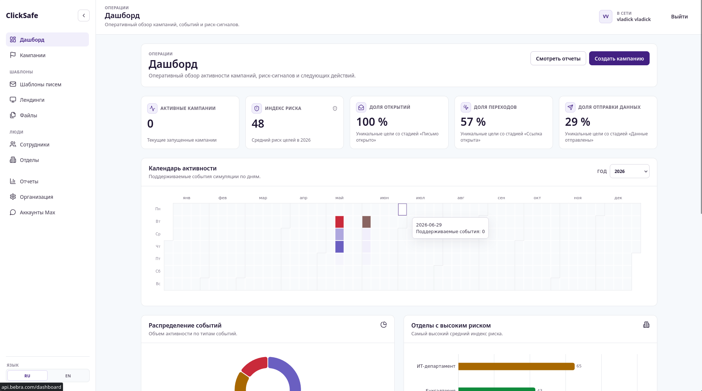
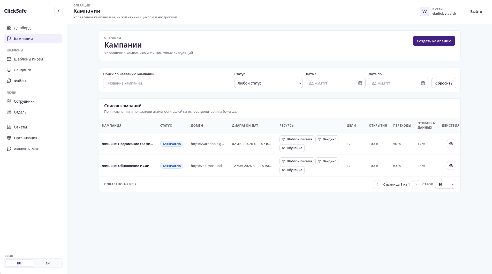
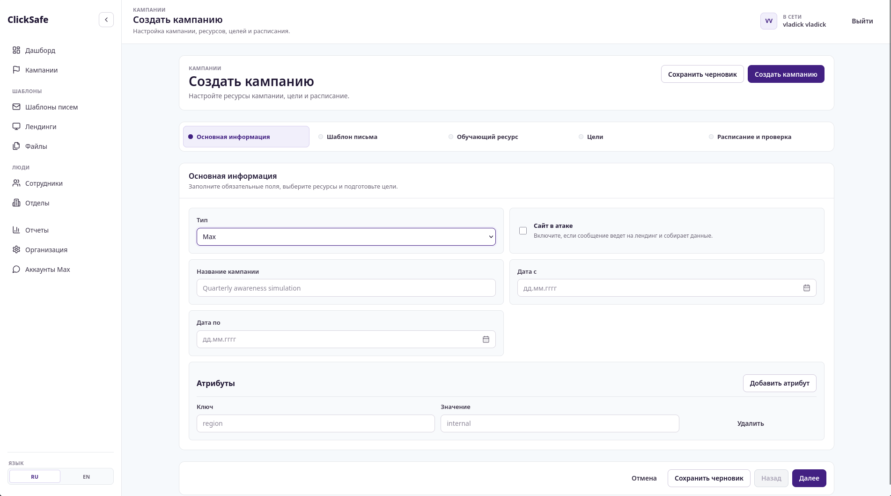
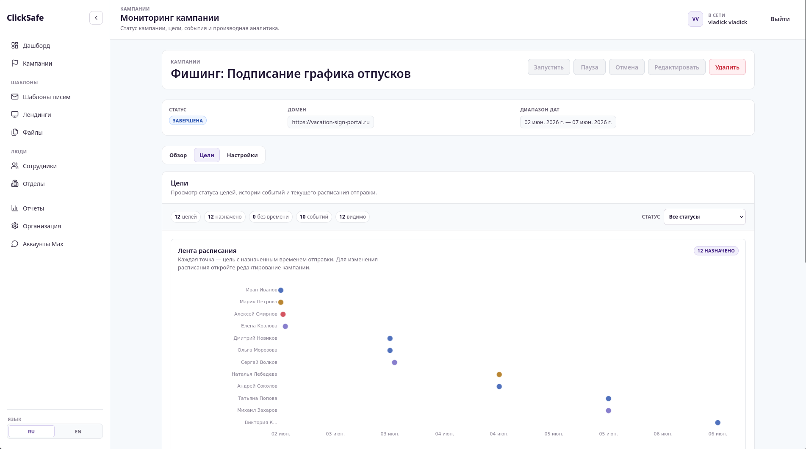
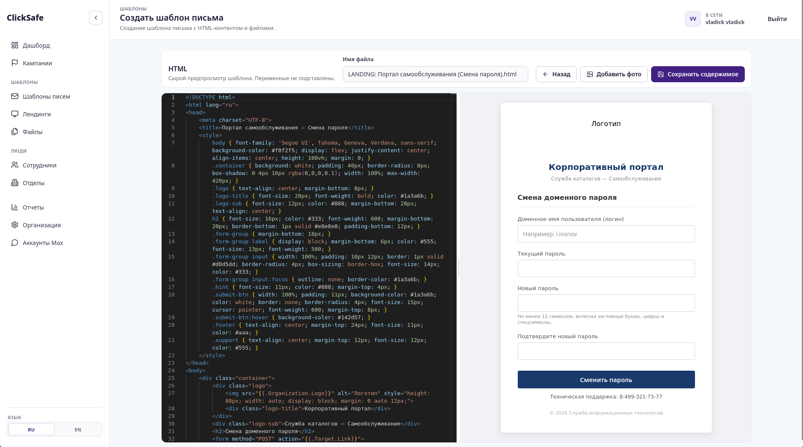
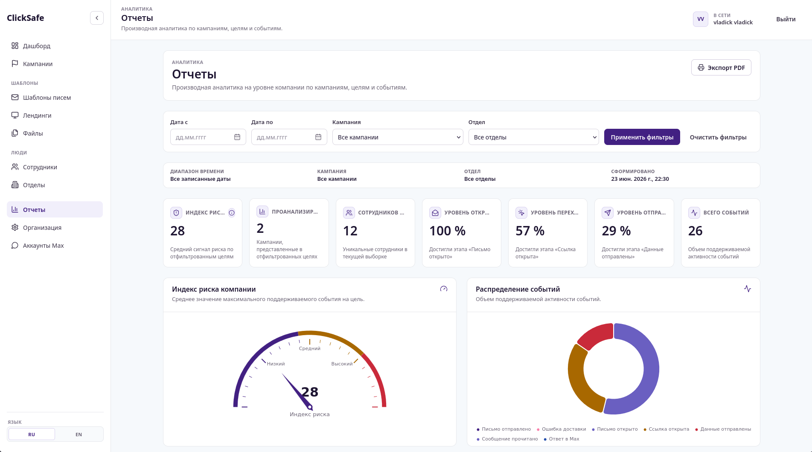

# ClickSafe

Платформа для симуляции фишинговых атак и повышения осведомлённости сотрудников в области информационной безопасности.

Организация создаёт фишинговую кампанию, выбирает сотрудников-целей и канал атаки. Платформа автоматически доставляет сообщения, отслеживает реакцию каждого сотрудника и собирает статистику — кто открыл письмо, кто перешёл по ссылке, кто ввёл данные на поддельной странице. По итогам генерируется отчёт.

---

## Скриншоты













---

## Возможности

**Каналы атаки**
- **Email** — фишинговое письмо с пикселем отслеживания открытия и подменёнными ссылками
- **Max** — фишинг через мессенджер Max, с отслеживанием прочтения и ответа
- **Голос** *(опционально)* — клонирование голоса и синтез речи для голосовых звонков (CPU или NVIDIA GPU)

**Отслеживание целей**

Каждая цель проходит по воронке статусов:

```
Pending → Sent → Opened → Clicked → Submitted
                        ↘ Replied   (для Max-кампаний)
```

**Управление контентом**
- HTML-редактор для писем и лендинг-страниц (Monaco Editor)
- Шаблонизация плейсхолдерами (`{{.FirstName}}`, `{{.Company}}` и др.)
- Встроенный менеджер вложений

**Аналитика и отчёты**
- Дашборд с графиками (ECharts) в реальном времени
- PDF-экспорт отчётов
- Лог событий по каждой цели

**Инфраструктура**
- Фоновые воркеры для автоматической рассылки по расписанию
- Rate limiting на логин
- Argon2id для хранения паролей

---

## Стек

| Слой | Технологии |
|---|---|
| Backend | Go, Echo v5, pgx v5, sqlc |
| Frontend | Vue 3, Element Plus, ECharts, Monaco Editor |
| БД | PostgreSQL |
| Адаптеры | Python (gRPC) — Max-мессенджер, голосовой синтез/распознавание |
| Инфра | Docker Compose, Caddy |

---

## Архитектура

```
api/
  service/        — HTTP-сервер + воркеры
  frontend/       — Vue 3 SPA
  tooling/        — CLI: миграции, seed-данные

business/
  domain/         — доменный слой (одна сущность — один пакет)
  usecase/        — сценарии с несколькими доменами
  sdk/            — database, dbtest, filestore, seed

adapters/
  max/            — адаптер Max-мессенджера (Python/gRPC)
  voice/          — голосовой адаптер (Python/gRPC, TTS + ASR)

foundation/       — logger, mail, password, token, worker
```

Бизнес-логика построена по принципу dependency injection через интерфейсы. Хранилища — sqlc-генерированные запросы к PostgreSQL. Транзакции передаются через контекст (`database.TxRunner`).

---

## Быстрый старт

**Требования:** Docker, Docker Compose

**1. Создай `.env`**

```bash
cp .env.example .env
# заполни: POSTGRES_*, SMTP_*, AUTH_TOKEN_HASH_KEY, MAX_ADAPTER_*
```

**2. Подними стек**

```bash
make up
# или в фоне:
make up-d
```

Это запустит: PostgreSQL, миграции, API, Max-адаптер, фронтенд (Caddy на 80/443).

**3. Загрузи демо-данные** *(опционально)*

```bash
make seed
```

Приложение доступно на `http://localhost`.

---

## Голосовой адаптер *(опционально)*

Адаптер для клонирования голоса и распознавания речи запускается отдельным профилем.

```bash
# CPU
make voice-up-d

# NVIDIA GPU (CUDA)
make voice-gpu-up-d
```

---

## Разработка

```bash
# Только Go unit-тесты (без Docker)
make test-unit

# Тесты фронтенда (Vitest)
make test-frontend

# Интеграционные тесты (нужен Docker)
make test-integration
```

Миграции и seed через tooling-утилиту:

```bash
# применить миграции
make migrate

# миграции + demo seed
make migrate-seed
```

---

## Переменные окружения

| Переменная | Описание |
|---|---|
| `POSTGRES_USER` / `POSTGRES_PASSWORD` / `POSTGRES_DB` | Подключение к БД |
| `SMTP_HOST` / `SMTP_PORT` / `SMTP_USERNAME` / `SMTP_PASSWORD` | SMTP для email-рассылки |
| `AUTH_TOKEN_HASH_KEY` | Ключ для HMAC-подписи токенов сессии |
| `MAX_ADAPTER_GRPC_TOKEN` / `MAX_ADAPTER_SECRET_KEY` | Аутентификация Max-адаптера |
| `API_VOICE_ADAPTER_ADDR` | Адрес голосового адаптера (если используется) |
